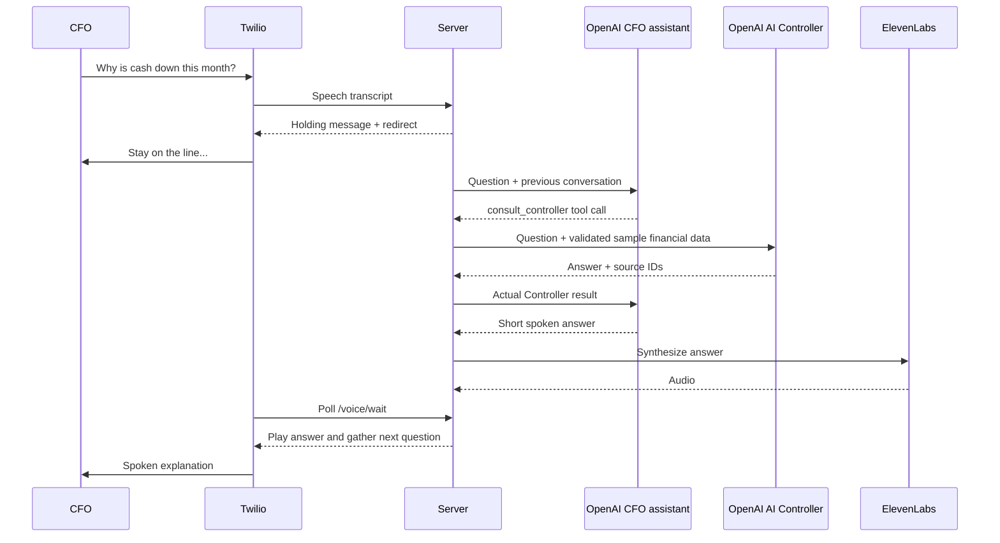

# CFO Voice Agent

A Node/Express phone assistant using **OpenAI GPT-5.4 Mini**, **Twilio speech recognition**, and **ElevenLabs speech**. When the CFO asks a question, the assistant says it will check with the Controller, consults a separate AI Controller, and speaks the answer back on the same call.

The Controller uses the fictional August 2026 data in `data/sample-financials.json`. It does not contact a human or connect to an accounting system.

## Example call

1. Assistant: “Hello, I'm your AI finance assistant. This demo uses sample company data. What would you like to ask our AI Controller?”
2. CFO: “Why is cash down this month?”
3. Assistant, voiced by ElevenLabs: “Stay on the line. I’ll check with our Controller.”
4. The separate OpenAI Controller reviews the sample cash bridge while the caller stays on the line.
5. Assistant: “Cash is down mainly because collections from a few enterprise customers are running behind. Three accounts explain most of the variance.”
6. The CFO can ask follow-up questions such as “Which three accounts?” or “How much is delayed?” Say “goodbye” to end the call.

That cash-down question uses the exact approved reply after a successful Controller consultation; capitalization, repeated spaces, and trailing speech punctuation are ignored. The greeting discloses sample data, so the approved reply has no additional disclosure prefix. Other questions use model-generated wording, and missing facts are reported as unavailable. Response time depends on the model and network. In this demo, “this month” means the dataset's August 2026 period.

The three fictional enterprise accounts have delayed payments of $80,000, $60,000, and $40,000. Together they explain the $180,000 shortfall against planned collections and planned closing cash. Actual cash still fell $280,000; the delayed amounts are not subtracted again from the cash bridge. The approved sentence is stored in the `cash-down-explanation` context fact. Removing that fact disables the fixed reply when replacing the sample dataset.

## Run the offline walkthrough

Requires Node.js 22 or newer. Run commands from this folder:

```sh
npm ci
npm run demo
npm test
```

`npm run demo` runs the actual assistant and Controller orchestration with scripted SDK responses. It prints the example conversation, makes no external requests, and produces no audio or phone call. Tests also use fake providers and synthetic data.

## Deploy on Render

Render can provide the public HTTPS endpoint, so ngrok and a locally running server are unnecessary for hosted calls.

1. Push this `voiceAgent` folder to its own Git repository. Keep `.env` and `node_modules` excluded; the included `.gitignore` does this.
2. In Render, choose **New → Web Service**, connect that repository, and use the settings below. Alternatively, create a Blueprint from the included `render.yaml`.
3. Add these settings from your local `.env` to the service's **Environment** tab: `OPENAI_API_KEY`, `TWILIO_ACCOUNT_SID`, `TWILIO_AUTH_TOKEN`, `TWILIO_PHONE_NUMBER`, `ELEVENLABS_API_KEY`, and `ELEVENLABS_VOICE_ID`. Your local `.env` is not uploaded automatically.
4. Leave `PUBLIC_BASE_URL` and `PORT` unset on Render. The app uses Render's `RENDER_EXTERNAL_URL` and assigned `PORT` automatically. Do not copy the old example ngrok URL into Render. Set `PUBLIC_BASE_URL` only if you later use a custom domain.
5. Deploy, then open `https://YOUR-SERVICE.onrender.com/health`. A healthy service returns JSON with `status: "ok"`.
6. Set the Twilio number's incoming-call webhook to **POST** `https://YOUR-SERVICE.onrender.com/voice/incoming`, and its call-status webhook to **POST** `https://YOUR-SERVICE.onrender.com/voice/status`.
7. Call your Twilio number and ask, “Why is cash down this month?”

| Render setting | Value |
| --- | --- |
| Service type | Web Service |
| Runtime | Node |
| Root directory | Leave blank if `voiceAgent` is the repository root; use `voiceAgent` if deploying the parent repository |
| Build command | `npm ci` |
| Start command | `npm start` |
| Health check path | `/health` |
| Instances | One, because sessions and audio are in memory |
| Node version | Node 22, selected by `.node-version` |

The Blueprint is configured for a paid `0.5c-512mb` instance. For reliable incoming calls, use a paid instance: [Render's free web services](https://render.com/docs/free#spinning-down-on-idle) sleep after 15 idle minutes and can take about a minute to restart. This can cause the first Twilio request to time out. A free instance is suitable for a manual trial if you first open `/health` and wait for the service to become ready.

If using the Blueprint inside the parent repository, set its path to `voiceAgent/render.yaml` and add `rootDir: voiceAgent` to the service definition. For outbound calls from your local CLI after deployment, update your local `PUBLIC_BASE_URL` to the Render URL.

Render references: [Node/Express deployment](https://render.com/docs/deploy-node-express-app), [automatic URL and port](https://render.com/docs/environment-variables), [Blueprint configuration](https://render.com/docs/blueprint-spec).

## Configure a live phone call locally

Copy `.env.example` to `.env` and fill in:

| Variable | Purpose |
| --- | --- |
| `OPENAI_API_KEY` | OpenAI API access for both agents |
| `OPENAI_MODEL` | CFO assistant model; defaults to `gpt-5.4-mini` |
| `CONTROLLER_MODEL` | Separate Controller model; defaults to the assistant model |
| `TWILIO_ACCOUNT_SID` | Twilio account used to place an outbound call |
| `TWILIO_AUTH_TOKEN` | Validates Twilio webhook signatures and authorizes outbound calls |
| `TWILIO_PHONE_NUMBER` | Your Twilio phone number in E.164 format |
| `CFO_PHONE_NUMBER` | Optional default outbound destination |
| `ELEVENLABS_API_KEY` | ElevenLabs API access |
| `ELEVENLABS_VOICE_ID` | The voice used for spoken replies |
| `PUBLIC_BASE_URL` | Public HTTPS origin pointing to this server, e.g. an ngrok tunnel |
| `PRISMTRACE_API_KEY`, `PRISMTRACE_PROJECT_ID` | Optional PRISM tracing credentials for both agents |
| `PRISMTRACE_HOST` | Optional PRISM endpoint; defaults to the project's PRISM host |

The default port is **3001**, so this project can run alongside the original server. Start a tunnel:

```sh
ngrok http 3001
```

Set `PUBLIC_BASE_URL` to that tunnel's HTTPS URL, then start the server:

```sh
npm start
```

In your Twilio number's configuration, set:

- **A call comes in:** `POST https://YOUR-TUNNEL/voice/incoming`
- **Call status changes:** `POST https://YOUR-TUNNEL/voice/status`

You can then call the Twilio number. To have the agent call the CFO instead:

```sh
npm run call -- +15551234567
```

Replace the example destination with the intended number; this command places a real phone call. If your Twilio account restricts outbound destinations, use a verified destination. The script configures that call's answer and status webhooks automatically. No phone number is bought or account configuration changed by this project.

Check the server at `http://localhost:3001/health`. There is no frontend dashboard. Without both ElevenLabs credentials, or if synthesis fails, the agent uses Twilio's built-in voice.

## How a turn works



The model work runs as a background job inside the Node process. `/voice/gather` responds with the holding message; `/voice/wait` returns either a short pause and another redirect or the completed answer. The default whole-turn deadline is 35 seconds, including answer synthesis. This avoids keeping a single Twilio webhook open for the full model/tool loop.

Greeting and holding audio are warmed at startup and cached. A cache miss may take up to the six-second synthesis timeout before fallback speech. No artificial delay is added after the answer becomes ready. This version uses turn-based Twilio speech gathering; it has no bidirectional audio streaming transport.

## Project map

| File | Change here for |
| --- | --- |
| `src/agent.js` | CFO persona, Responses tool loop, conversation history |
| `src/controller.js` | Controller instructions, cash reconciliation, source validation |
| `data/sample-financials.json` | Sample balances, movements, context, and unavailable information |
| `src/app.js` | Phone greeting, holding phrase, speech gathering, waiting, timeout behavior |
| `src/speech.js` | ElevenLabs synthesis, voice model, caching and fallback |
| `src/audio-store.js` | Temporary audio storage |
| `src/call-store.js` | Call sessions, listening tokens, expiry, cancellation |
| `src/config.js` | Environment configuration |
| `src/prismtrace.js` | PRISM model timing/status traces, without conversation content |
| `scripts/call.js` | Outbound call creation |
| `scripts/demo.js` | Offline example conversation |

The sample opening cash plus actual cash movements must equal closing cash; the Controller validates this at startup. A delayed expected receipt is contextual information, not another cash outflow. Unknown source IDs and malformed Controller responses are rejected. Model prose is grounded by instructions and source validation; the application does not mathematically verify every natural-language claim.

## Current operating limits

- Conversation state, jobs, and audio live in one Node process. Restarting it ends active work; run one instance for this version. Idle sessions expire after 30 minutes; each call is limited to 30 questions.
- Twilio signatures are required. Use the exact configured public origin, and restart after changing the tunnel URL. The app exposes no public outbound-call API.
- Webhook retries reuse turn tokens instead of launching duplicate model work. A terminal call-status callback cancels pending work. A failed or timed-out Controller turn leaves history unchanged and offers a retry.
- No database or live financial connector is configured. Replace the Controller's data source when you have an approved source of company information. Caller identity verification would also need to be added before serving private company data.
- OpenAI request storage is disabled with `store: false`; this setting does not itself define provider retention policies. The app does not enable Twilio call recording or write transcripts to disk.
- When PRISM credentials are configured, both agents emit model role, model name, timing, and success/error metadata. Prompts, financial data, spoken answers, and provider error messages are excluded. Trace delivery runs in the background with a short timeout and does not block a phone response.

Provider references: [OpenAI function calling](https://developers.openai.com/api/docs/guides/function-calling), [Twilio Gather](https://www.twilio.com/docs/voice/twiml/gather), [Twilio webhook signatures](https://www.twilio.com/docs/usage/tutorials/how-to-secure-your-express-app-by-validating-incoming-twilio-requests), [ElevenLabs speech API](https://elevenlabs.io/docs/api-reference/text-to-speech/convert).
